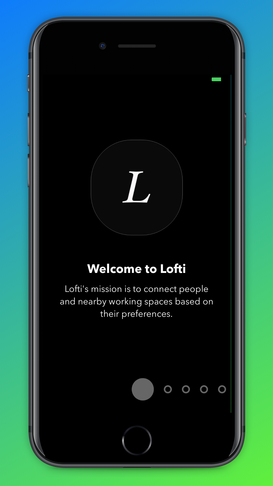
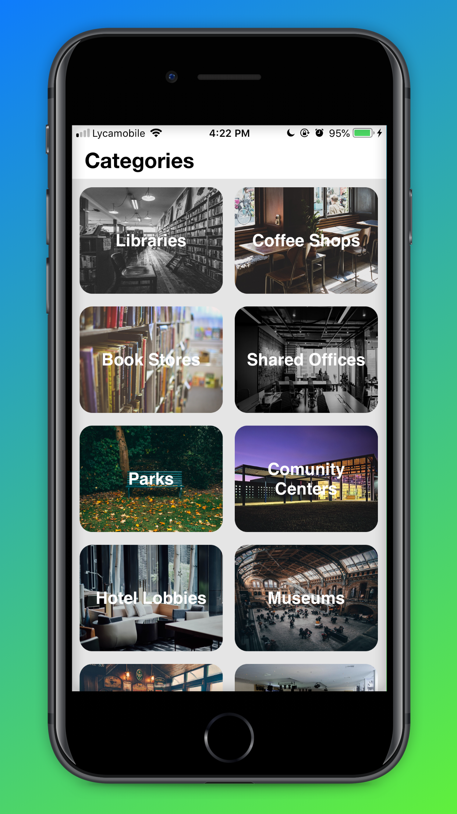
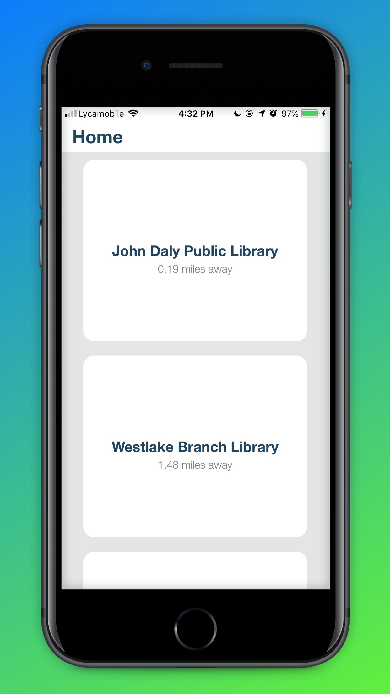
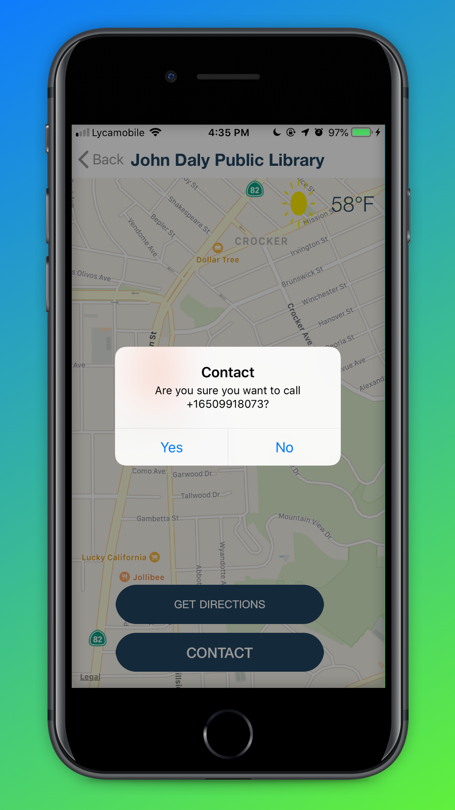
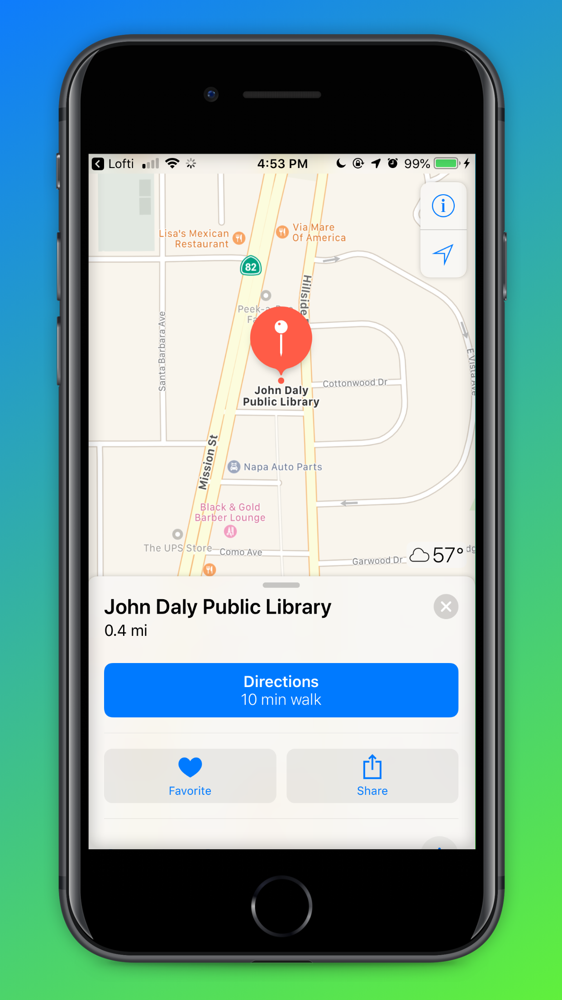

# Lofti

### Overview & Mission Statement

Lofti's mission is to connect people and nearby working spaces based on their preferences. I believe that your productivity can be tremendously boosted if you are working on a comfortable environtment. With Lofti, you can select your optimum preferences of a working/study spot ranging from public libraries to shared offices such as WeWork.
### Screenshots
</img>

### Features

Users can...

* Select your personal working/study spot preferences.
* See a list of nearby working/study spaces based on your preferences
* See the distance, in miles, from your current location to the space's location.
* See a Map View of the space's area and its surroundings.
* View the current weather temperature at the space's location.
* Contact the space's customer service for further informations.
* Get directions from the location to the space with a click of a button.

### Engineer(s)

* **Medi Assumani** - *iOS Engineer and Founder*

### Project Built With

* [Swift 4.2](https://developer.apple.com/swift/) - Used for core app features.
* [Xcode 10.1](https://developer.apple.com/xcode/) - Used as main IDE.
* [CoreLocation API](https://developer.apple.com/documentation/corelocation) -  Used to get user's coordinates to fetch nearby working/study spaces.
* [MapKit](https://developer.apple.com/documentation/mapkit) - Used for the MapView of the space's location.
* [Yelp Fusion API](https://www.yelp.com/developers/documentation/v3) - Powers the app by providing locations on the backend.
* [Paper-Onboarding Module](https://github.com/Ramotion/paper-onboarding) - Used for user onboarding animation.
* [ReachabilitySwift Module](https://github.com/ashleymills/Reachability.swift) - Used to manage device's internet. connectivity.
* [NVActivityIndicatorView](https://github.com/ninjaprox/NVActivityIndicatorView) - Used for beautifull loading indicator.
* [ViewAnimator](https://github.com/marcosgriselli/ViewAnimator) - Used to animate collection view cells.

### License

This project is licenced under the Apache 2.0 License - see the <a href="https://github.com/MediBoss/Lofti/blob/master/LICENSE">LICENSE</a> file for details

## Acknowledgments

* Hat tip to anyone who's code was used
* My SPD instructor
* Inspiration
* Stack overflow
